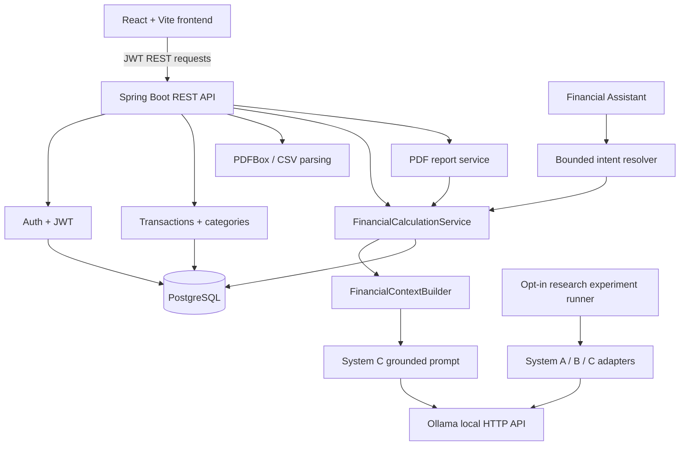

# UPIQ AI — Personal Finance Management Platform

UPIQ AI is a full-stack personal finance platform for recording transactions, importing statement data, organizing spending, and reviewing calculated financial summaries. It also includes a bounded financial assistant backed by a deterministic calculation layer and a local Ollama model, plus PDF report downloads. The repository contains a separate research implementation for comparing question-only, raw-context, and verified-context LLM inputs.

This README is the quick onboarding guide. See [docs/PROJECT_IMPLEMENTATION_GUIDE.md](docs/PROJECT_IMPLEMENTATION_GUIDE.md) for the technical handover and [docs/API.md](docs/API.md) for controller-backed endpoint details.

## 1. Project status

### Product features implemented

- Registration, login, JWT-protected requests, and user-scoped transaction/category operations.
- Transaction create, list, read, update, delete, category filtering, and bulk delete.
- Backend PDF and CSV statement parsing; the current frontend upload screen accepts PDF files and saves reviewed transactions individually.
- Deterministic merchant/description categorization with income/expense awareness and an `Uncategorized` fallback.
- Automatic creation of the matching user category when confident auto-categorization assigns one.
- Dashboard with a verified latest-available-month overview plus existing selected-date-range widgets.
- Deterministic financial calculations and a bounded Financial Assistant.
- Deterministic category icons and monthly budgets stored in browser local storage.
- Authenticated PDF financial report download.

### Research implementation

- Deterministic calculation engine and structured `FinancialContext` builder.
- System A/B/C input models, prompt adapters, and a shared Ollama generation boundary.
- Grounded System C prompt and Ollama client.
- Opt-in experiment runner and JSON result writer; the runner is inactive during ordinary app startup.
- Research benchmark data and the selected case IDs are checked in under `backend/src/main/resources/research/`. Research methodology, runner use, and known runtime limitations are summarized in the technical handover. Local run outputs are kept under the git-ignored `research-results/` directory.
- **No answer-quality evaluation metrics or statistical analysis are implemented.** Existing latency/token/duration fields are generation metadata, not measures of correctness or grounding.

### Remaining work and current limitations

| Area | Status | Current repository evidence |
|---|---|---|
| CSV upload in the browser | Partially implemented | Backend parser accepts CSV; `UploadPDF.jsx` only accepts PDF. |
| Research answer-quality evaluation | Not implemented | No scoring, hallucination metrics, or statistical analysis in the runner. |
| Larger, reproducible research evaluation | Planned | Current small-batch runs are not enough to support scientific comparisons. |
| Fraud detection, investment advice, voice assistant, smart notifications | Not implemented | No corresponding product services or routes. |
| Budget persistence across devices | Not implemented | Budgets are held in browser `localStorage`, not a backend budget API. |
| Admin dashboard / role-managed user administration | Not implemented | There are user-management routes, but no admin dashboard or controller-level admin-role checks. |
| Assistant coverage | Partially implemented | Chat routes only a bounded set of intent patterns and categories. |
| System B live runtime | Partially implemented | The prompt adapter and runner exist; recorded local runs encountered slow/failing System B generations. See the research limitations in the technical handover. |

## 2. Key features

### Authentication

- `POST /api/auth/register` creates an account; `POST /api/auth/login` returns a JWT.
- Protected frontend requests attach the token as `Authorization: Bearer <token>` through `frontend/src/services/axios.js`.
- Transaction and category operations receive the user from `@AuthenticationPrincipal` and pass that user's ID to their services.
- JWTs are stateless. The default token lifetime is 24 hours.

**Security handover items:** the public registration DTO accepts an optional `role`, and `AuthService` accepts `ADMIN`. Also, `/api/v1/users` and its email/username lookup routes do not check for an admin role; the list route returns all users to any authenticated caller. Do not expose these endpoints in a public deployment without addressing these authorization behaviors.

### Transaction management

The authenticated user can create, list, fetch by ID, filter by category, update, delete one transaction, or delete all their transactions. Backend repository/service paths scope list/filter/bulk operations by `userId`; single-record read/update/delete check transaction ownership. Browser filtering and search are primarily client-side; there is no general server-side date/search query endpoint in `TransactionController`.

### Statement import

Parsing lives in `backend/src/main/java/com/upiq/pdf`. PDF text is extracted with PDFBox and parsed with deterministic text/date/amount patterns; CSV rows are read with Commons CSV. This is text parsing, **not OCR**. The parser returns candidate transaction fields (amount, type, description, date, payment method, and category when the CSV provides one); parsing alone does not persist transactions.

The current upload page accepts a PDF, asks the backend to parse it, previews candidates and probable duplicates, and then sends each selected transaction to `POST /api/transactions`. The backend's create flow applies categorization where the category is blank or `Uncategorized`, then persists each transaction under the authenticated user. The current page does not expose the backend's CSV support.

### Smart categorization and category creation

```text
Description / merchant
        ↓
Existing normalization (Unicode normalization, uppercase, reference/number cleanup)
        ↓
Deterministic merchant and description signals
        ↓
Income/expense-specific rules
        ↓
Category + confidence (or Uncategorized)
        ↓
Persist transaction category
        ↓
Ensure the user's Category record exists
```

- Rules are deterministic; this is not an ML classifier.
- Income has separate salary/payroll and investment signals. Rent/accommodation rules only apply to expenses.
- Explicit categories supplied on transaction create/update are preserved. Automatic categorization is used for missing, blank, or `Uncategorized` categories.
- Unknown/low-confidence descriptions remain `Uncategorized`.
- Accommodation signals include PG, Paying Guest, rental/rent, hotel, lodge, and guest house variants, which map to `Rent` for expenses.
- `ensureCategoryExists` scopes by user and type and avoids creating another matching category record.
- `POST /api/transactions/categorize-uncategorized` runs the existing batch workflow for only the authenticated user's uncategorized rows.

### Dashboard

The verified overview calls `GET /api/financial/dashboard`. The backend locates that user's newest transaction, chooses its month as the analyzed month, and computes income, expense, net balance, savings rate, expense comparison with the preceding month, and category expense totals through `FinancialCalculationService`. Existing dashboard widgets remain separate and use the page's date-filtered transaction data. Values have no stored currency metadata; the verified overview and report do not infer a currency.

### Financial Assistant

The assistant supports a bounded set of recognized amount, category, comparison/trend, largest-expense, and net-balance questions. It resolves an intent and computes the requested values before asking System C to explain them:

```text
User question
  → FinancialChatIntentResolver
  → FinancialIntentDispatcher
  → FinancialCalculationService
  → FinancialContextBuilder
  → verified FinancialContext
  → System C grounded prompt
  → Ollama
  → natural-language answer
```

**The LLM is not the source of truth for financial calculations.** The deterministic financial engine calculates values first. Unsupported question types are declined; an Ollama outage is returned as a handled assistant error. The service requires a running Ollama endpoint and a configured model only when a supported assistant question invokes System C.

### Financial report

`GET /api/financial/report` requires authentication and uses the principal's user ID. It reuses the dashboard service for the latest available month and verified summaries/categories, and the calculation engine for up to five largest expense transactions. PDFBox generates a downloadable PDF containing the period, summary, comparison, category breakdown, largest transactions, calculation-based insights, and generation timestamp. No totals are calculated in the browser.

## 3. System architecture



The standard app does not start an experiment automatically. PostgreSQL and the backend are included in the root Compose file; the frontend runs separately with Vite during local development.

## 4. Technology stack

Versions below come from the repository's Maven/Node configuration and lockfile.

| Layer | Technology |
|---|---|
| Frontend | JavaScript, React/React DOM `^19.2.0`, Vite `^7.2.4` (lockfile resolves 7.3.0), React Router `^7.10.1`, Tailwind CSS `^4.1.18`, Recharts `^3.6.0`, Axios `^1.13.2` |
| Backend | Java 21, Spring Boot 3.3.1, Spring Security, Spring Data JPA / Hibernate (managed by Spring Boot), Maven Wrapper configured for Maven 3.6.3 |
| Persistence | PostgreSQL 16 via `postgres:16-alpine` in Compose |
| Statement parsing / reports | PDFBox 3.0.3, Apache Commons CSV 1.10.0; JJWT 0.12.3; Lombok 1.18.36 |
| AI | Ollama HTTP `/api/generate`; model selected by `OLLAMA_MODEL`/`ollama.model`; repository default is blank, not an automatic model pull |
| Containers | Dockerfiles for backend/frontend and Docker Compose configuration; root Compose starts PostgreSQL and backend |

Frontend Node compatibility follows Vite 7's declared engine: Node `^20.19.0` or `>=22.12.0`. The frontend uses JavaScript/JSX; it has no TypeScript compiler setup.

## 5. Project structure

```text
backend/src/main/java/com/upiq/     Spring Boot application packages
backend/src/main/resources/         application profiles and research JSON resources
backend/src/test/java/              backend unit and slice tests
frontend/src/pages/                 routed screens
frontend/src/components/            UI, dashboard, categories, layout, transactions
frontend/src/services/              Axios-backed API functions
frontend/src/context/               auth, budgets, date filter, theme state
frontend/src/routes/                routes and protected-route guard
frontend/src/utils/                 category and transaction helpers
docs/                               handover, research notes, screenshots
docker/                             alternate Compose file
research-results/                   local experiment outputs; git-ignored
docker-compose.yml                  root development stack: PostgreSQL + backend
```

Important backend packages: `auth`, `config`, `transaction`, `transaction.categorization`, `category`, `pdf`, `financial.dashboard`, `financial.chat`, `financial.report`, and `research` (calculation, context, dataset, intent, LLM, and experiment packages).

## 6–7. Local setup and clone (Windows)

### Prerequisites

- Git.
- JDK 21. Verify with `java --version`.
- Node.js 20.19+ (or 22.12+) and npm. Verify with `node --version` and `npm --version`.
- Docker Desktop with Compose v2 for the recommended PostgreSQL setup. Verify with `docker --version` and `docker compose version`.
- Ollama only if using the Financial Assistant or running LLM research. Verify with `ollama --version` and `ollama list`.
- No global Maven installation is needed; use `backend\mvnw.cmd`.

The configured remote is `https://github.com/yourxharsh19/UPIQ-AI.git`. Git will therefore create a directory named `UPIQ-AI` when cloned without a destination override:

```powershell
git clone https://github.com/yourxharsh19/UPIQ-AI.git
cd UPIQ-AI
```

To use the workspace name instead, specify it as the clone destination:

```powershell
git clone https://github.com/yourxharsh19/UPIQ-AI.git UPIQ-2.0
cd UPIQ-2.0
```

## 8–9. Environment and database

There is a root `.env.example`, `backend/.env.example`, and `frontend/.env.example`. There are no `application-dev.yml` or `application-local` outside the backend resource directory; current profiles are `local`, `prod`, and `research`. Copy the root template for Compose and edit the placeholder values locally:

```powershell
Copy-Item .env.example .env
```

Set a private JWT secret for local work; never reuse the example placeholder or commit `.env`. Root `.env` is read by Docker Compose. Spring Boot does not automatically load that file for a native `mvnw spring-boot:run`; set variables in the PowerShell process before launching the backend. `backend/.env.example` is a reference template, not an automatic dotenv loader. The frontend defaults to `http://localhost:8080/api`; copy `frontend/.env.example` to `.env.local` only if you need to override `VITE_API_BASE_URL`.

The development database defaults are database `upiq`, user `postgres`, password `postgres`, host port `5432`. These are local-only convenience defaults. The PostgreSQL-only command is:

```powershell
docker compose up -d postgres
docker compose ps
docker exec upiq-postgres pg_isready -U postgres -d upiq
```

Wait for the `postgres` service to show `healthy`; `pg_isready` should report that it is accepting connections. The root Compose file also defines the backend service. Its database URL uses Compose DNS (`postgres:5432`) inside the container; a native backend uses `localhost:5432`.

Main variables: `DB_URL` or `DB_HOST`/`DB_PORT`/`DB_NAME`, `DB_USERNAME`, `DB_PASSWORD`, `JWT_SECRET`, and `SPRING_PROFILES_ACTIVE`. Ollama variables are optional for non-AI features: `OLLAMA_BASE_URL` (default `http://localhost:11434`), `OLLAMA_MODEL` (default blank), `OLLAMA_TEMPERATURE` (default `0.0`), and `OLLAMA_TIMEOUT` (default `60s`). `VITE_API_BASE_URL` is the frontend API origin. `SERVER_PORT` is used for the published host port by Compose; the backend application listens internally at 8080.

## 10–11. Run backend and frontend

Start the database first. From a new PowerShell window in the repository root, prepare native-backend settings (replace the JWT value with a private local secret):

```powershell
$env:DB_URL = "jdbc:postgresql://localhost:5432/upiq"
$env:DB_USERNAME = "postgres"
$env:DB_PASSWORD = "postgres"
$env:JWT_SECRET = "replace-with-a-private-local-secret-at-least-32-characters"
$env:SPRING_PROFILES_ACTIVE = "local"
```

To enable the Financial Assistant, also start Ollama and set the installed model:

```powershell
$env:OLLAMA_BASE_URL = "http://localhost:11434"
$env:OLLAMA_MODEL = "llama3.1:8b"
$env:OLLAMA_TEMPERATURE = "0.0"
```

In that terminal:

```powershell
cd backend
.\mvnw.cmd clean test
.\mvnw.cmd spring-boot:run
```

The API listens at `http://localhost:8080`. In another terminal:

```powershell
cd frontend
npm ci
npm run dev
```

Vite prints its local URL, normally `http://localhost:5173`.

Alternatively, with the root `.env` configured for Docker:

```powershell
docker compose up -d --build
docker compose ps
```

This Compose stack runs PostgreSQL and the backend, **not the frontend**. Start Vite separately, or use the frontend Dockerfile with your own serving configuration.

## 12. Ollama / AI setup

Ollama is not required for authentication, transaction CRUD, parsing, categorization, dashboard calculations, or PDF report generation. A supported Financial Assistant question calls local Ollama through System C; if it is unreachable or no model is configured, the assistant returns a handled error. The application does not download or pull models automatically. The A/B/C experiment runner is separately opt-in and should not be needed for ordinary product operation. System B is experimental and has recorded local runtime issues; it is not a product dependency.

Install/start Ollama separately, then inspect available models:

```powershell
ollama --version
ollama list
```

If the team elects to use the repository's previously verified local model and it is not listed, pull it explicitly and test it:

```powershell
ollama pull llama3.1:8b
ollama run llama3.1:8b
```

Configure `OLLAMA_MODEL=llama3.1:8b` in the backend process or root `.env` for Compose. The code default is empty, so do not assume a configured model merely because Ollama is installed.

## 13. Full project quick start

1. Clone the repository and confirm its folder name.
2. Copy `.env.example` to `.env`; replace the JWT placeholder with a private local secret.
3. Start PostgreSQL with `docker compose up -d postgres` and wait for health.
4. Start the backend from `backend` with `..` environment variables set and `.\mvnw.cmd spring-boot:run`.
5. Start the frontend from `frontend` with `npm ci` and `npm run dev`.
6. Register or log in at the Vite URL.
7. Upload a statement PDF, review the extracted rows, and save the transactions.
8. Review or categorize transactions; use the existing “Categorize Uncategorized” action as needed.
9. View the dashboard and verified latest-month overview.
10. Configure/start Ollama to use the Financial Assistant.
11. Download the financial report from the Dashboard.

## 14. Common troubleshooting

### Java version mismatch

The backend compiler targets Java 21. Check `java --version` and ensure `JAVA_HOME` points to a JDK 21 installation before running the wrapper.

### PostgreSQL is not ready

Run `docker compose ps`, then `docker exec upiq-postgres pg_isready -U postgres -d upiq`. For native backend execution the database host must be `localhost`; inside Compose it is `postgres`.

### JWT is rejected after a restart

Tokens are signed using `JWT_SECRET`. Changing the secret invalidates previously issued tokens; log in again. Keep the same private secret across normal local restarts.

### Ollama is unavailable / model is missing

Check `ollama list`, ensure the Ollama service is running at `OLLAMA_BASE_URL`, and set `OLLAMA_MODEL` to an installed tag. The app does not automatically download the model. Other app features can be used without Ollama.

### Frontend cannot reach the API

Check that the backend is listening at `http://localhost:8080`, then inspect `VITE_API_BASE_URL` (default `http://localhost:8080/api`). Browser requests attach JWT automatically after login.

### Research run is unexpectedly activated

The runner is conditioned on `upiq.runExperiment=true`. Keep that property unset/false during ordinary app startup. Research seeding has a separate `research` profile and `RESEARCH_SEEDING_ENABLED` gate; use only a dedicated local research database.

## 15. Team development guide

Before modifying code:

```powershell
git status
```

Create a focused feature branch (choose a descriptive name):

```powershell
git checkout -b feature/report-documentation
```

Run backend tests and frontend build:

```powershell
cd backend
.\mvnw.cmd test
cd ..\frontend
npm run build
```

Review before pushing:

```powershell
git status
git diff
git diff --check
```

Confirm the change set contains no secrets, generated model/output files, `node_modules`, `target`, `dist`, or unrelated changes. Preserve existing V1-derived behavior unless a task explicitly requires changing it. The working tree may contain work from another sprint; coordinate before staging broad directory changes.

## 16. Research implementation

### Deterministic calculation engine

`FinancialCalculationService` implements total income, total expense, net balance/savings rate, category totals/expense percentages, period comparisons, category comparisons, largest transactions, and spending concentration. It scopes its repository queries by user ID, performs decimal arithmetic with `BigDecimal`, and rounds financial outputs to two places. It is the numerical source for the verified dashboard, FinancialContext, and report.

### FinancialContext

`FinancialContextBuilder` converts typed verified calculation results to a stable versioned object with provenance (`UPIQ_DETERMINISTIC_FINANCIAL_ENGINE`), `verified`, calculation type, periods, typed facts, and definitions. It provides a structured verified boundary before text generation; it does not itself calculate values.

### System A, B, and C

- **A:** question only.
- **B:** question plus raw transaction context.
- **C:** question plus verified `FinancialContext`; the existing grounded prompt requires the model to use only those supplied facts and not guess missing values/currency.

The three adapters share the Ollama generation boundary/client and configured model settings during an experiment. A previous local small-batch run recorded slow System B failures; this is a runtime limitation, not an evaluation conclusion. Reproduction details and the exact observations are in the research section of the [technical handover](docs/PROJECT_IMPLEMENTATION_GUIDE.md#15-research-architecture).

### Experiment runner and evaluation

`ExperimentRunner` processes prepared cases deterministically in case-ID order and A → B → C, records output/error and model/latency plus optional Ollama token/duration metadata, and writes a JSON run artifact via `ExperimentResultWriter`. `ExperimentRunApplicationRunner` is guarded by `upiq.runExperiment=true`. There is no score, accuracy/hallucination measure, statistical analysis, or scientific claim implemented.

## 17. Research and product limitations

- The benchmark dataset is small (28 questions in the current resource files) and small-batch outputs alone do not establish superiority.
- A recorded local System B run had slow failures and a response content-type error. A separate diagnostic recorded exceptionally slow CPU-only prompt evaluation; configure a hard external process timeout for future runs. Details and scope are in the research section of the [technical handover](docs/PROJECT_IMPLEMENTATION_GUIDE.md#15-research-architecture).
- Some benchmark calculation types are explicitly non-executable in `CalculationType` (for example recurring totals and top-N categories); the mapper/dispatcher rejects unsupported mappings rather than substituting another calculation.
- Currency is not represented on transaction records, so verified financial views intentionally do not infer it.
- Smart categorization is deterministic rules, not a learned classifier.
- Financial Assistant supports bounded intents and known categories rather than arbitrary financial questions.
- Budgets are browser-local and are not a shared/persisted financial feature.
- PDF extraction is text based; scanned/image-only statements do not receive OCR.
- Registration role assignment and user-directory endpoints need authorization hardening before public deployment (see Authentication section and API guide).

## 18. Implemented vs TODO

| Feature | Status | Notes |
|---|---|---|
| Authentication | Implemented | JWT login/register; see role-assignment caveat. |
| Transaction management | Implemented | CRUD, category filtering, per-user scope. |
| PDF import | Implemented | Text extraction and preview/save; no OCR. |
| CSV import | Partially implemented | Backend parser endpoint only; current upload screen accepts PDF. |
| Smart categorization | Implemented | Deterministic, type-aware rules and fallback. |
| Automatic category creation | Implemented | Ensures the matching category exists for that user. |
| Dashboard | Implemented | Verified backend latest-month summary plus legacy client-side widgets. |
| Category icons | Implemented | Deterministic known-category mapping; custom icon fallback for unknown names. |
| Budget tracking | Partially implemented | Frontend progress display; values in localStorage only. |
| Financial Assistant | Implemented | Bounded intents; uses System C/Ollama for supported answers. |
| Financial report | Implemented | Authenticated PDF; uses verified backend calculations. |
| System A/B/C experiment foundation | Implemented | Input adapters and shared generation boundary. |
| Automated experiment runner | Implemented | Explicit opt-in, records raw results only. |
| Research evaluation | Not implemented | No answer-quality scoring/statistics. |
| Fraud detection | Not implemented | No feature code found. |
| Budget prediction | Not implemented | Current budgets are manual; no prediction model. |
| Investment suggestions | Not implemented | No feature code found. |
| Voice assistant | Not implemented | No feature code found. |
| Smart notifications | Not implemented | No notification service found. |
| Admin dashboard | Not implemented | No frontend route/dashboard; user administration authorization is incomplete. |

## 19. Roadmap boundaries

- **Immediate project work:** harden registration role assignment and user-directory authorization; decide whether to expose CSV in the upload UI; evaluate backend persistence for budgets; improve the PDF extraction workflow for unsupported/scanned statements.
- **Research work:** reproduce the System B runtime failure with bounded infrastructure; add a separately specified answer-quality evaluation protocol and more benchmark cases before making any comparisons.
- **Future product features:** fraud detection, predictive budgets, investment suggestions, voice interaction, notifications, and an admin console remain unimplemented ideas, not shipped behavior.

## 20. Contribution guide

- Frontend screens and UI: `frontend/src/pages/` and `frontend/src/components/`.
- Frontend API calls/auth headers: `frontend/src/services/`.
- Routes/auth gate: `frontend/src/routes/` and `frontend/src/context/AuthContext.jsx`.
- Transactions: `backend/src/main/java/com/upiq/transaction/`.
- Categorization: `backend/src/main/java/com/upiq/transaction/categorization/`.
- Categories: `backend/src/main/java/com/upiq/category/`.
- Parsing: `backend/src/main/java/com/upiq/pdf/`.
- Dashboard/chat/report: `backend/src/main/java/com/upiq/financial/`.
- Verified calculations: `backend/src/main/java/com/upiq/research/calculation/`.
- Context, intents, Ollama/System C, and experiment: corresponding packages under `backend/src/main/java/com/upiq/research/`.
- API and implementation handover: `docs/API.md` and `docs/PROJECT_IMPLEMENTATION_GUIDE.md`.
