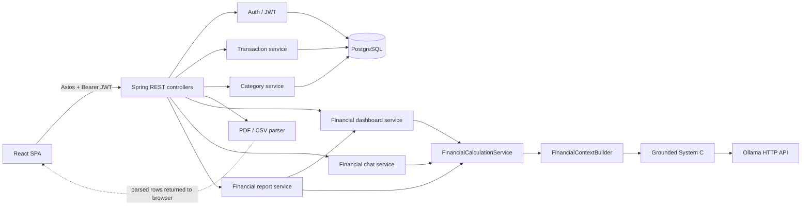
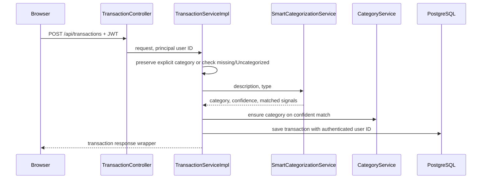

# UPIQ AI — Project Implementation Guide

This document is the technical handover for contributors. It describes the implementation in this repository at the time of writing; the route/controller code and configuration are authoritative when details change. For a quick local start, see the root [README](../README.md). For request/response examples, see [API.md](API.md).

## 1. Project overview

UPIQ AI is a React and Spring Boot personal finance application. It stores user transactions and categories in PostgreSQL, supports statement parsing, categorizes eligible transactions deterministically, calculates verified financial summaries, provides a bounded Ollama-backed financial assistant, and generates an authenticated PDF report. The `research` packages also implement an opt-in A/B/C LLM input experiment pipeline.

The repository is a single Spring Boot backend organized into feature packages, not a running microservice mesh. Frontend pages call one REST API. Current product interfaces are under `frontend/src/routes/AppRoutes.jsx`.

## 2. Product architecture



Root `docker-compose.yml` starts PostgreSQL and the backend. It does not include the frontend. The Vite frontend runs separately in the normal development workflow.

## 3. Backend architecture

- `com.upiq.auth`: registration, login, users, JWT service and user entity/repository.
- `com.upiq.config`: stateless JWT filter, Spring Security, common API response, and exception handling.
- `com.upiq.transaction`: transaction REST controller, DTO/entity/repository and persistence service.
- `com.upiq.transaction.categorization`: deterministic rules and batch categorization.
- `com.upiq.category`: user category CRUD and automatic category creation.
- `com.upiq.pdf`: PDF text extraction, CSV parsing, upload validation, mapping utilities, and parsed-row DTOs.
- `com.upiq.financial.dashboard`: newest-transaction-month selection and dashboard response.
- `com.upiq.financial.chat`: bounded intent resolver, authenticated chat controller and System C orchestration.
- `com.upiq.financial.report`: authenticated PDF report endpoint and PDFBox document construction.
- `com.upiq.research.calculation`: deterministic calculation service and result DTOs.
- `com.upiq.research.context`: verified context schema/builder.
- `com.upiq.research.intent`: benchmark metadata to typed calculation dispatch.
- `com.upiq.research.llm`: Ollama configuration/client, grounded prompt builder and System C.
- `com.upiq.research.dataset`: classpath benchmark data loading/seeding support.
- `com.upiq.research.experiment`: A/B/C adapters, shared generation boundary, runner, and JSON writer.

The application uses Spring Data JPA/Hibernate and PostgreSQL. `spring.jpa.hibernate.ddl-auto` is `update`; no versioned schema-migration tool is configured in the inspected build.

## 4. Frontend architecture

- `frontend/src/pages/`: Login, Register, Dashboard, UploadPDF, Transactions, Categories, FinancialAssistant.
- `frontend/src/components/`: reusable page components, layout/sidebar, categories, transactions and dashboard widgets.
- `frontend/src/services/`: Axios API wrappers. `axios.js` sets the base URL and attaches the local-storage JWT.
- `frontend/src/context/`: auth, theme, date-filter, and browser-local budget state.
- `frontend/src/routes/`: React Router route table and `ProtectedRoute`.
- `frontend/src/utils/`: client-side transaction helpers and category icon mapping.

The dashboard contains both a verified latest-available-month backend section and V1-derived client-side widgets, date filtering, recent activity, and local budget progress. The latest-month report/verified overview does not follow the separate date-range filter.

## 5. Authentication flow

1. The browser sends email/password to `POST /api/auth/login`.
2. `AuthService` verifies the password and issues a signed JWT with email subject, role, user ID claim, and expiration.
3. `AuthContext` stores the token in browser `localStorage`.
4. The Axios request interceptor sends `Authorization: Bearer <token>`.
5. `JwtAuthenticationFilter` validates the JWT, loads the user by email, and places the `User` object in the security context.
6. Protected controllers accept `@AuthenticationPrincipal User` and pass `user.getId()` to user-data services.

`SecurityConfig` permits `/api/auth/**` and `/health/**`; other routes require authentication. An expired/invalid token may cause the frontend interceptor to remove the token and return the browser to the login page.

### Security caveats from current code

- `RegisterRequest` accepts a role value and `AuthService` accepts both `USER` and `ADMIN`; the registration route is public. New public registrations should not be able to self-assign administrative privileges.
- `UserController` list and email/username lookup routes are authenticated by the global filter but do not enforce an admin role or restrict responses to the caller. Treat those endpoints as a pre-deployment authorization issue.
- The `application.yml` fallback JWT secret is for local development. Always configure a private high-entropy secret outside local development.

These caveats are documented as-is; this documentation change does not alter application behavior.

## 6. Transaction flow



The stored `Transaction` has scalar `userId`, `amount` (`Double`), `type`, `category`, `description`, `date`, and `paymentMethod` fields. There is no JPA relationship to `User` or `Category`; ownership is enforced in repository/service logic. List/category/bulk deletion methods filter by user ID. Single-record read/update/delete load by transaction ID and then compare its owner ID with the principal ID.

## 7. PDF/CSV import flow

1. `ParserController` receives a multipart file at `POST /api/pdf/upload` and requires the authenticated principal.
2. `ParserService` validates the file and chooses the PDF or CSV parser.
3. PDF parsing uses PDFBox `PDFTextStripper` and deterministic regex/text-block rules in `AIPDFParserService`; despite its class name this path does not call an LLM and does not OCR images.
4. CSV parsing uses the first header row and Commons CSV. It recognizes several aliases for amount/type/description/date/payment method/category.
5. `ParsingResponse` contains parse counts, candidate `TransactionRequest` rows, errors and a message. The endpoint does not persist the transactions.
6. The frontend preview performs duplicate checks against the logged-in user's transaction list. On save it sends each non-duplicate row to `POST /api/transactions` with category `Uncategorized`.
7. Normal transaction creation applies categorization, creates a category record on a confident category assignment, and persists the row. The upload screen currently accepts PDF only; CSV is backend-only.

Amount/date extraction is heuristic and statement-format dependent. The user should review parsed rows before saving.

## 8. Smart categorization flow

`SmartCategorizationService` combines description and optional merchant, applies Unicode NFKC/case normalization, strips reference-like IDs and long numeric runs, and matches word-bounded signals. Expense rules include Food, Fuel, Transport, Shopping, Bills & Utilities, Health, Entertainment, Groceries, Education, Rent, Insurance, and Cash Withdrawal. Income is handled separately (Salary and Investment signals). An unknown match returns `Uncategorized` with low confidence.

Category resolution in `TransactionServiceImpl` only calls the rules for a null/blank or `Uncategorized` category. An explicitly supplied category is preserved. A confident auto-match calls `CategoryService.ensureCategoryExists(name, type, userId)`. That operation ignores blank/`Uncategorized`, checks existing user/name matches case-insensitively, and saves only if absent. The batch endpoint finds only that user's uncategorized rows and applies the same rules; it saves the updates and ensures each matching category once per batch.

Accommodation/rent signals include `PG`, `PAYING GUEST`, `PG ACCOMMODATION`, `RENT`, `RENTAL`, `HOUSE RENT`, `ROOM RENT`, `HOTEL`, `HOTELS`, `HOTEL BOOKING`, `HOTEL STAY`, `LODGE`, `GUEST HOUSE`, and `GUESTHOUSE`. Rent rules are skipped for income.

## 9. Category creation flow

Manual category create/update/delete is provided by `CategoryController` and `CategoryServiceImpl`. The principal's user ID is used for inserts and repository operations. Updating/deleting first looks up categories by both ID and user ID. `ensureCategoryExists` is the automatic path used by transaction categorization and prevents case-insensitive duplicates for the same user. Category icon presentation is resolved in the frontend; known names map to stable icons, while the Category entity can retain a custom icon for unrecognized names.

## 10. Dashboard data flow

`FinancialDashboardService.getDashboard(userId)`:

1. Finds the latest dated transaction for that user.
2. If none exists, returns `hasTransactionData=false` and empty category spending.
3. Converts the latest transaction date to `YearMonth` and selects that month plus its immediately preceding month.
4. Calls `FinancialCalculationService.calculateNetBalance` for the latest month.
5. Calls `comparePeriods(..., "expense")` for previous-vs-latest expenses.
6. Gets expense category names for the latest month and calls `calculateCategoryTotal` for each, sorted by total descending.

`VerifiedFinancialOverview` displays this response with a note that values are calculated from transaction data. Other widgets on Dashboard process the frontend's transaction list and date filter; do not treat every legacy widget as server-verified. The report uses the backend verified dashboard response and latest month.

## 11. Financial calculation engine

`FinancialCalculationService` uses user-scoped repository queries and `BigDecimal` arithmetic. The `Transaction` entity stores amount as `Double`; the engine converts values using `BigDecimal.valueOf`, uses decimal math, and rounds output to two places.

Implemented calculations:

- `calculateTotalIncome` and `calculateTotalExpense`.
- `calculateNetBalance`: income minus expense and a savings rate (zero when income is zero).
- `calculateCategoryTotal` and `calculateCategoryPercentage` for a category/type/period.
- `comparePeriods` for income or expense totals and absolute/percentage change (percentage unavailable with a zero baseline).
- `compareCategories` for two category totals and differences.
- `findTopTransactions` for a bounded top-N list, optionally by transaction type.
- `calculateSpendingConcentration` for top-N expense concentration against total expenses.

Calculations use inclusive date ranges and do not add currency metadata. `CalculationType` contains additional benchmark definitions marked non-executable; the dispatcher rejects them rather than changing formulas or approximating unsupported queries.

## 12. FinancialContext

`FinancialContext` is a versioned JSON structure created from a successful typed dispatcher result. It includes `context_version`, source/provenance, `verified`, calculation type, transaction type, period(s), typed `facts`, and formula/field `definitions`. `FinancialFacts` uses typed numeric/date/category fields instead of an untyped map.

Example shape (illustrative only; not a claim about any user's data):

```json
{
  "context_version": "1.0",
  "source": "UPIQ_DETERMINISTIC_FINANCIAL_ENGINE",
  "verified": true,
  "calculation_type": "TOTAL_EXPENSE",
  "transaction_type": "expense",
  "facts": { "total_expense": 1250.00 },
  "definitions": { "total_expense": "Σ amount where type = expense in [start, end]" }
}
```

The context creates a structured verified layer between the database/calculation engine and the LLM. The prompt builder serializes it and instructs System C to use only supplied facts, avoid invented values/currency/raw-transaction claims, and mark unavailable details as unavailable.

## 13. Financial Assistant

`POST /api/financial-chat` takes only `{ "question": "..." }`. The controller supplies the authenticated user ID; the frontend cannot select another user. `FinancialChatIntentResolver` recognizes supported phrases, categories, periods and comparison language. It defaults an unspecified period to the authenticated user's latest transaction month and resolves comparison phrases to periods. `FinancialIntentDispatcher` invokes an existing deterministic calculation; `FinancialContextBuilder` builds verified facts; `SystemCService` sends the original question plus context to Ollama.

Supported routes include category expense totals; total income/expense; net balance/savings rate; category comparisons; period income/expense comparisons and spending trend; and largest expense transaction. The resolver is bounded and phrase based; unsupported questions receive a supported-intent explanation without calling the LLM. When no user transactions exist, it returns a no-data response. Ollama requires a configured installed model and running endpoint; no pull/download occurs from application code.

## 14. PDF report generation

`GET /api/financial/report` reads the authenticated principal's ID and returns raw `application/pdf` bytes with a month-based attachment filename. `FinancialReportService` calls `FinancialDashboardService` for the analyzed month, summary, comparison and category totals. It calls `FinancialCalculationService.findTopTransactions` for at most five expense entries in the analyzed month. PDFBox 3 builds the PDF; no currency is inferred where the stored records do not include it. An empty account receives a short valid PDF explaining that no transaction data is available.

The frontend's `DownloadReportAction` calls through the existing Axios instance with `responseType: "blob"`, derives the filename from `Content-Disposition`, and downloads without navigating away. The report follows the dashboard's latest-data-month logic rather than a custom date range.

## 15. Research architecture

Research resources are loaded by `ResearchDatasetLoader` from classpath JSON files under `backend/src/main/resources/research/`. It validates profiles, transaction rows, benchmark question IDs and references. Optional database seeding is separately gated by `SPRING_PROFILES_ACTIVE=research` and `RESEARCH_SEEDING_ENABLED=true`, with a guard against known production datasource substrings. Use a dedicated local research database.

### System A/B/C

- **A — question only:** prompt adapter includes the case question without context.
- **B — question + raw transaction context:** prompt adapter serializes relevant raw transaction rows with the question.
- **C — question + verified FinancialContext:** adapter delegates to the grounded System C prompt builder.

All three run through one `OllamaExperimentGenerationBoundary` and `OllamaClient` using the same configured model, base URL, temperature and timeout. The input/context is the experimental condition. Benchmark reference metadata is preserved separately in the result model; it is not the System A/B prompt input.

### Runner and output

`ExperimentRunner` sorts cases by ID and executes A, B, C. `ExperimentRunApplicationRunner` is conditional on `upiq.runExperiment=true`, reads a caller-provided case JSON file and writes results with `ExperimentResultWriter`. The writer creates parent directories and uses `CREATE_NEW` (it refuses to overwrite an existing file). Result models record run/configuration metadata, contexts, raw answer or typed error, latency, and optional Ollama prompt/eval token counts and duration. Result files under `research-results/` are ignored by Git.

The standard benchmark definition has 28 question entries. The current selected small-batch file has three IDs (`Q001`, `Q006`, `Q011`). The runner does **not** score output quality or calculate evaluation metrics. No experiment conclusions are supported by infrastructure alone.

### Research calculation and benchmark conventions

The calculation engine scopes every query to a user and an inclusive date range (the end date includes the full day). It sums positive transaction amounts by income/expense type; net balance is income minus expense, and savings rate is net balance divided by income (0 when income is 0). Category percentage is category expense divided by total expense (0 when total expense is 0). Period comparison treats the supplied comparison/baseline range as period 1 and the primary question range as period 2; absolute change is period 2 minus period 1 and percentage change uses period 1 as denominator (unavailable when the baseline is zero). No transaction deduplication or currency inference is performed by the calculation layer. Unsupported benchmark calculation types are rejected by the dispatcher rather than approximated; the examples include recurring totals, top-N category aggregates, largest transaction within a category, category-wide increase, and average monthly expense comparisons.

### Reproducing the recorded small-batch run

The benchmark source data is checked in at `backend/src/main/resources/research/`: question definitions are in `questions/benchmark-questions.json`, profiles in `dataset/profiles.json`, transactions in `dataset/transactions.json`, and the selected IDs in `experiment-case-selection.json`. The definitions contain question/calculation metadata, not an `expectedAnswer` field. The three selected cases are Q001 (Food expense total for August 2026), Q006 (August vs July expense comparison), and Q011 (largest August expense). Their profile is `profile_01`. Q001's verified result is 3,620.00 across 8 transactions (27.50%); Q006's totals are 11,356.00 for July and 13,166.00 for August (difference 1,810.00; 15.94%); Q011's largest expense is 2,100.00 (BESCOM, 2026-08-08, Net Banking). These verified contexts are result references and System C input; the separate reference field is not passed to A or B.

The reproducible live test fixture is `backend/src/test/java/com/upiq/research/experiment/Checkpoint4ECaseFixture.java`; it adapts the checked-in dataset to the real calculation/context pipeline without requiring PostgreSQL. `Checkpoint4ESmallBatchLiveTest` runs the existing A/B/C runner and is opt-in. From `backend`, with Ollama running and `llama3.1:8b` already installed:

```powershell
.\mvnw.cmd test
.\mvnw.cmd '-Dtest=Checkpoint4ESmallBatchLiveTest' '-Dupiq.liveExperiment=true' '-Dollama.model=llama3.1:8b' '-Dollama.baseUrl=http://localhost:11434' '-Dollama.temperature=0.0' '-Dexperiment.output=../research-results/checkpoint4e-small-batch.json' test
```

The opt-in test uses a 180-second client timeout for each generation; model, endpoint, temperature, and shared client are the same for A/B/C. It does not download models. The result writer refuses to overwrite a file; choose a new `experiment.output` path for another run. The local artifact `research-results/checkpoint4e-small-batch-20260929.json` contains the recorded run and is intentionally git-ignored, so it is preserved in this workspace but is not distributed in a normal clone. No generated model files belong in this repository.

The recorded run used `llama3.1:8b`, temperature 0.0, `http://localhost:11434`, and the 180-second timeout. It had three B generation failures (reported as an `application/octet-stream` response extraction error near the timeout), three A answers indicating unavailable financial information, and three C generations. C's Q001/Q006 answers used `$` despite no currency in the supplied facts; Q011 included an unsupported claim that this was the only expense transaction. System C's grounding prompt was subsequently hardened. These are observations from the recorded run, not quality scores or conclusions.

### Runtime caveat

In a separate Q001/System B diagnostic, the server log recorded CPU-only prompt evaluation of approximately 3,665 tokens taking about 69,873,728 ms, then logged HTTP 200 after roughly 19 hours; the Java client had already returned a content-type extraction error. The client timeout configured for that diagnostic was 300 seconds but did not bound the total observed wall time. This isolated observation does not explain the client/server mismatch or establish a general cause. Use a hard external process timeout for future live research runs, preserve typed generation failures, and do not interpret a failed generation as an incorrect answer. Do not make quality comparisons from the existing outputs; no evaluation metrics or statistical analysis are implemented.

## 16. Database model overview

| Entity | Table | Important fields |
|---|---|---|
| `User` | `users` | ID, username, email, password hash, full name, role, active state, timestamps/login metadata. |
| `Transaction` | `transactions` | ID, scalar `userId`, amount (`Double`), type, category string, description, local date-time, payment method. |
| `Category` | `categories` | ID, scalar `userId`, name, type, description, color, icon. |

There are no entity associations/FKs in these three model classes. Repository filters and service-level ownership checks carry user scoping. Budgets are not stored in PostgreSQL; the frontend stores them in browser `localStorage`.

## 17. API endpoint overview

The current controller-backed routes are documented with methods, request bodies and scope notes in [API.md](API.md). Protected frontend services live under `frontend/src/services/`. There is no research-runner REST endpoint; the runner is an opt-in Spring application runner. No general transaction date/search REST filters or budget endpoints are present.

## 18. Environment configuration

Configuration files:

- Root `.env.example`: Docker Compose defaults and templates for database, JWT, model, and frontend API URL.
- `backend/.env.example`: local backend variable reference; the JVM does not automatically load dotenv files.
- `frontend/.env.example`: `VITE_API_BASE_URL` for Vite.
- `backend/src/main/resources/application.yml`: DB defaults, port 8080, local-development JWT fallback, research-seeding disabled, Ollama properties.
- `application-local.yml`: local profile database/JPA logging settings.
- `application-prod.yml`: production profile logging settings; most DB config remains in the base file/env.
- `application-research.yml`: dedicated research DB defaults and opt-in seeding.
- Root `docker-compose.yml`: Postgres/backend environment interpolation, including `host.docker.internal` for Ollama from the backend container.

`OLLAMA_MODEL` defaults to blank. Known model tag from prior project verification: `llama3.1:8b`; that value is not automatically embedded/pulled by the checked-in application configuration. `OLLAMA_BASE_URL` defaults to localhost for a native backend and the Compose template uses `host.docker.internal` for a containerized backend. `OLLAMA_TEMPERATURE` defaults to 0.0 and `OLLAMA_TIMEOUT` to 60 seconds.

Never commit `.env`, `.env.local`, JWT signing secrets, DB credentials, or private result artifacts. `.env.example` is only a template and its development defaults are not production credentials.

## 19. Testing strategy

Backend tests are under `backend/src/test/java`. They cover calculation formulas, intent mapping/dispatch, context construction, category/transaction behavior, chat orchestration and experiment models/runner. Live Ollama tests are opt-in/skipped in ordinary runs; normal Maven tests do not require the Ollama daemon. Run:

```powershell
cd backend
.\mvnw.cmd clean test
```

Frontend production bundle verification:

```powershell
cd frontend
npm run build
```

The package also contains an ESLint `lint` script. The repository currently has no API contract generation or end-to-end browser test framework configured.

## 20. Known limitations and remaining work

- Authentication role assignment and user-directory endpoints need access-control fixes before public deployment.
- Backend accepts CSV but the frontend uploader accepts only PDF; statement parsing is heuristic and has no OCR.
- Transactions do not have a currency field, so financial calculations and the report cannot reliably label currency.
- Amount is stored in a `Double` before the calculation engine's BigDecimal conversion boundary.
- Financial Assistant intent recognition is bounded and depends on configured local Ollama for supported natural-language answers.
- Dashboard legacy widgets include frontend calculations; the verified overview/report uses server-side deterministic results.
- Monthly budgets are localStorage only.
- Research dataset is small, several benchmark calculation types are non-executable, and there is no answer-quality evaluation or statistical analysis.
- Local System B runtime issues are recorded but not resolved/revalidated here.

## 21. Implemented feature inventory

Implemented product paths: authentication, transaction CRUD, PDF import, backend CSV parsing, deterministic categorization and category record creation, category CRUD/icons, dashboard, bounded financial chat, and PDF financial report. Partially implemented areas: frontend CSV import, durable budgets, broad natural-language coverage, and System B generation reliability. Not implemented: fraud detection, investment advice, voice assistant, smart notification service, budget prediction, admin dashboard, and research answer-quality metrics.

## 22. Team development workflow

1. Check `git status` and coordinate around existing local changes.
2. Create a task-specific feature branch.
3. Keep changes within the owning frontend/backend package; avoid rewriting V1-derived flows without explicit scope.
4. Run `backend\.\mvnw.cmd test` and `frontend\npm.cmd run build` as applicable.
5. Review `git diff` and `git diff --check`.
6. Before pushing, verify tests/build, inspect staged files, remove no user data, and ensure `.env`, model files, `node_modules`, `target`, `dist`, and unintended research outputs are not staged.

For focused ownership, see the Contribution Guide in [README.md](../README.md#20-contribution-guide-for-group-members).
