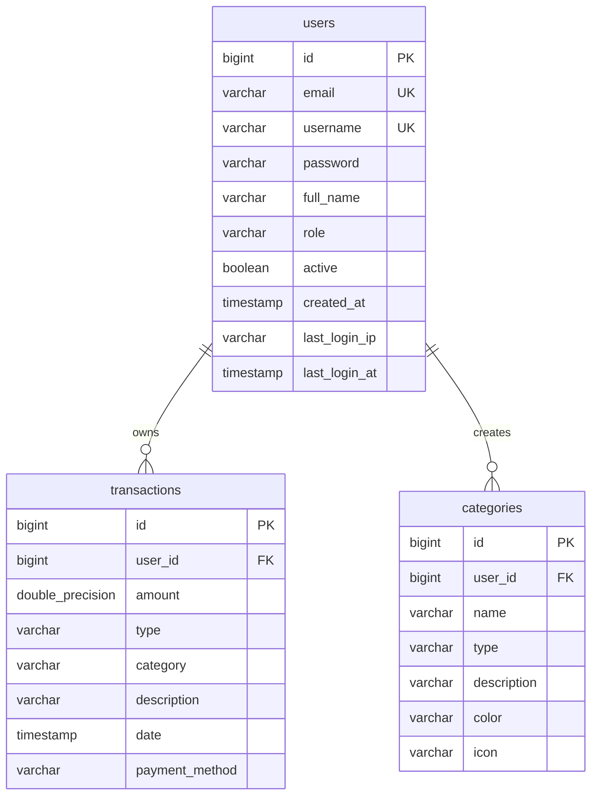
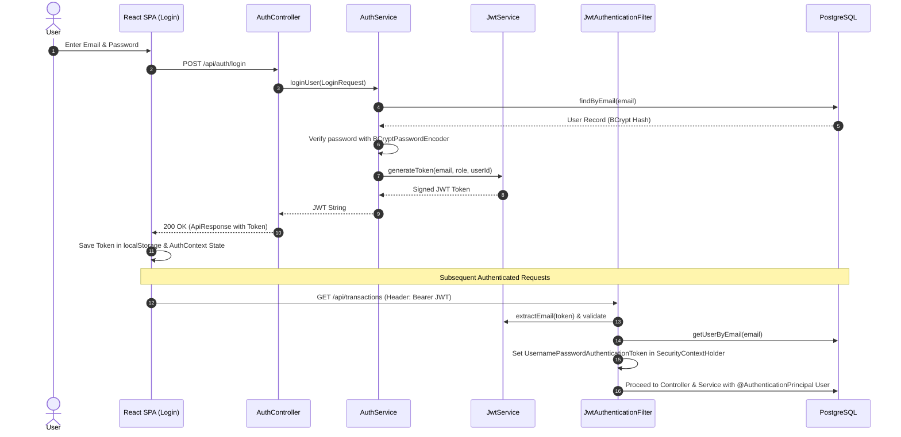

# UPIQ (Unified Personal Income & Query) - Comprehensive Architecture Report

This report provides an in-depth technical analysis of the **UPIQ** codebase, covering the architecture, tech stack, directory structure, database schema, API specification, security flows, frontend/backend logic, AI/heuristic parsing engine, key classes, and system limitations.

---

## 1. Complete Architecture

UPIQ uses a **Single-Container Monolithic Production Architecture** built for high efficiency, simple deployment, and low memory consumption (~512MB-1GB RAM).

```
┌───────────────────────────────────────────────────────────────────────────┐
│                          React Frontend (Vite)                            │
│           State: Context API (Auth, Theme, Budget, DateFilter)            │
│           Styling: Tailwind CSS v4 | HTTP: Axios Interceptors             │
└─────────────────────────────────────┬─────────────────────────────────────┘
                                      │ HTTP / REST (Bearer JWT)
                                      ▼
┌───────────────────────────────────────────────────────────────────────────┐
│                      Unified Spring Boot 3.3.1 Backend                    │
│  ┌──────────────────┬──────────────────┬─────────────────┬─────────────┐  │
│  │   Auth Module    │ Transaction Mod. │ Category Module │ PDF Parser  │  │
│  │ (BCrypt, JJWT)   │   (JPA Ledger)   │ (Custom Types)  │(PDFBox/RegEx)│  │
│  └──────────────────┴──────────────────┴─────────────────┴─────────────┘  │
│              Spring Security Filter Chain (JwtAuthFilter)                 │
└─────────────────────────────────────┬─────────────────────────────────────┘
                                      │ JDBC / Hibernate ORM
                                      ▼
┌───────────────────────────────────────────────────────────────────────────┐
│                        PostgreSQL Database (Neon)                         │
│                    Tables: users, transactions, categories                │
└───────────────────────────────────────────────────────────────────────────┘
```

### Key Architectural Traits
- **Evolutionary Monolith**: Refactored from a 6-microservice setup (API Gateway, Eureka, Auth, Transaction, Category, PDF Parser) into a unified single-JVM deployment to optimize serverless/free-tier hosting.
- **Stateless Authentication**: JWT tokens issued upon login carry claims (`userId`, `role`, `email`) and authorize all subsequent request headers.
- **Service-Layer Ownership Validation**: IDOR protection enforced across transactions and categories by matching entity owner IDs against authenticated principal credentials.

---

## 2. Tech Stack

### Frontend
| Component | Technology | Version | Description / Role |
| :--- | :--- | :--- | :--- |
| **Framework** | React | 18.2.0 | Single Page Application framework |
| **Build Tool** | Vite | 5.0.0 | Fast dev server & production bundling |
| **Styling** | Tailwind CSS | 4.0.0 | Utility-first styling with custom tokens |
| **Icons** | Lucide React | 0.344.0 | Modern icon set |
| **HTTP Client** | Axios | 1.6.7 | API calls with request/response interceptors |
| **Routing** | React Router DOM | 6.22.1 | Client-side routing with guarded routes |

### Backend
| Component | Technology | Version | Description / Role |
| :--- | :--- | :--- | :--- |
| **Runtime & Language** | Java (JDK) | 21 | OpenJDK runtime environment |
| **Framework** | Spring Boot | 3.3.1 | Core application framework |
| **Security** | Spring Security | 6.x | Authorization & authentication filter chain |
| **Database ORM** | Spring Data JPA | 3.3.1 | Hibernate ORM persistence layer |
| **Database** | PostgreSQL | 16 | Relational database (Hosted on Neon) |
| **JWT Library** | JJWT | 0.12.3 | JSON Web Token signing & parsing |
| **PDF Extraction** | Apache PDFBox | 3.0.3 | Extracting text streams from statement PDFs |
| **CSV Parsing** | Apache Commons CSV | 1.10.0 | Parsing tabular financial statements |
| **Boilerplate Helper** | Lombok | 1.18.x | Auto-generating getters, setters, builders |

---

## 3. Folder Structure

```
UPIQ/
├── README.md                           # Main workspace README
├── upiq-backend/                       # Spring Boot 3.3.1 Application
│   ├── Dockerfile                      # Multi-stage Docker build config
│   ├── pom.xml                         # Maven dependencies & project build definition
│   └── src/main/
│       ├── java/com/upiq/
│       │   ├── UpiqApplication.java    # Application entrypoint (@SpringBootApplication)
│       │   ├── auth/                   # Authentication module
│       │   │   ├── controller/         # AuthController, UserController, HealthController
│       │   │   ├── dto/                # LoginRequest, RegisterRequest, UserDTO
│       │   │   ├── model/              # User entity, Role enum
│       │   │   ├── repository/         # UserRepository (Spring Data JPA)
│       │   │   └── service/            # AuthService, UserService, JwtService
│       │   ├── transaction/            # Transaction management module
│       │   │   ├── controller/         # TransactionController
│       │   │   ├── dto/                # CreateTransactionRequest, TransactionResponse
│       │   │   ├── exceptions/         # TransactionNotFoundException
│       │   │   ├── model/              # Transaction entity
│       │   │   ├── repository/         # TransactionRepository
│       │   │   └── service/            # TransactionService & TransactionServiceImpl
│       │   ├── category/               # Category management module
│       │   │   ├── controller/         # CategoryController
│       │   │   ├── dto/                # CreateCategoryRequest, CategoryResponse
│       │   │   ├── exceptions/         # CategoryNotFoundException
│       │   │   ├── model/              # Category entity
│       │   │   ├── repository/         # CategoryRepository
│       │   │   └── service/            # CategoryService & CategoryServiceImpl
│       │   ├── pdf/                    # Automated PDF/CSV parsing module
│       │   │   ├── config/             # ParserConfig
│       │   │   ├── controller/         # ParserController
│       │   │   ├── dto/                # ParsingResponse, TransactionRequest
│       │   │   ├── exceptions/         # ParsingException
│       │   │   ├── service/            # AIPDFParserService, CSVParserService, ParserService, FileValidationService
│       │   │   └── utils/              # ParsingUtils
│       │   └── config/                 # Security & cross-cutting configs
│       │       ├── SecurityConfig.java # Spring Security configuration & CORS
│       │       ├── JwtAuthenticationFilter.java # Custom per-request JWT validation filter
│       │       ├── GlobalExceptionHandler.java  # Global REST exception handling
│       │       └── ApiResponse.java    # Standardized response wrapper
│       └── resources/
│           ├── application.yml         # Base properties (datasource, JWT secret)
│           └── application-prod.yml    # Production override properties
│
└── upiq-frontend/                      # Vite + React 18 SPA
    ├── package.json                    # Node dependencies & script runners
    ├── vite.config.js                  # Vite configuration
    └── src/
        ├── App.jsx                     # Root application component
        ├── main.jsx                    # React DOM entrypoint
        ├── index.css                   # Global styles & CSS variable tokens
        ├── components/                 # UI components
        │   ├── categories/             # Category modal/cards
        │   ├── dashboard/              # KPIStrip, InsightCards, CategoryBreakdown, etc.
        │   ├── layout/                 # Navbar, Sidebar, Layout containers
        │   ├── transactions/           # Transaction Table, Filters, Edit Modals
        │   └── ui/                     # Button, Card, EmptyState, Modal, SkeletonLoader
        ├── context/                    # Context providers
        │   ├── AuthContext.jsx         # User JWT state & auth operations
        │   ├── BudgetContext.jsx       # Monthly budget calculations
        │   ├── DateFilterContext.jsx   # Global date filter range state
        │   └── ThemeContext.jsx        # Dark/Light mode theme state
        ├── pages/                      # Page routes
        │   ├── Dashboard.jsx           # Main financial analytics dashboard
        │   ├── Transactions.jsx        # Ledger view & transaction manager
        │   ├── Categories.jsx          # Custom categories manager
        │   ├── UploadPDF.jsx           # Statement parser interface & duplicate check
        │   ├── Login.jsx               # User sign-in page
        │   └── Register.jsx            # Account creation page
        ├── routes/                     # Routing logic
        │   ├── AppRoutes.jsx           # React Router route registry
        │   └── ProtectedRoute.jsx      # JWT Auth wrapper guard
        ├── services/                   # Axios API service interfaces
        │   ├── axios.js                # Base instance + JWT interceptor
        │   ├── category.service.js     # Category endpoints
        │   ├── pdf.service.js          # File upload parser endpoint
        │   └── transaction.service.js  # Transaction CRUD endpoints
        └── utils/                      # Helper logic
            └── transactionUtils.js     # Calculations & filtering helpers
```

---

## 4. Database Schema

The database schema consists of 3 relational tables managed via PostgreSQL and Hibernate JPA.



### Table Specifications

#### `users`
- `id`: `BIGINT` (Primary Key, Auto-increment)
- `email`: `VARCHAR` (Not Null, Unique)
- `username`: `VARCHAR` (Unique)
- `password`: `VARCHAR` (Not Null, BCrypt Encrypted)
- `full_name`: `VARCHAR`
- `role`: `VARCHAR` (`USER` or `ADMIN`)
- `active`: `BOOLEAN` (Default `true`)
- `created_at`: `TIMESTAMP` (Not Null, set via `@PrePersist`)
- `last_login_at`: `TIMESTAMP` (Set via `@PreUpdate`)
- `last_login_ip`: `VARCHAR`

#### `transactions`
- `id`: `BIGINT` (Primary Key, Auto-increment)
- `user_id`: `BIGINT` (Not Null, owner foreign key reference)
- `amount`: `DOUBLE PRECISION` (Not Null)
- `type`: `VARCHAR` (Not Null, e.g., `income` or `expense`)
- `category`: `VARCHAR` (Not Null, e.g., `Food`, `Travel`, `Bills`, `Uncategorized`)
- `description`: `VARCHAR`
- `date`: `TIMESTAMP` (Not Null, defaults to `now()`)
- `payment_method`: `VARCHAR` (e.g., `UPI`, `Cash`, `Card`)

#### `categories`
- `id`: `BIGINT` (Primary Key, Auto-increment)
- `user_id`: `BIGINT` (Not Null, owner reference)
- `name`: `VARCHAR` (Not Null)
- `type`: `VARCHAR` (Not Null, `income` or `expense`)
- `description`: `VARCHAR`
- `color`: `VARCHAR` (Hex/Color code string)
- `icon`: `VARCHAR` (Lucide icon identifier string)

---

## 5. API List

All secured endpoints require an `Authorization: Bearer <JWT_TOKEN>` HTTP header.

### Authentication Endpoints (`/api/auth`)
| Method | Endpoint | Access | Payload / Params | Description |
| :--- | :--- | :--- | :--- | :--- |
| `POST` | `/api/auth/register` | Public | `RegisterRequest` (`email`, `password`, `fullName`) | Registers a new user account |
| `POST` | `/api/auth/login` | Public | `LoginRequest` (`email`, `password`) | Authenticates credentials and returns JWT token |

### Transaction Endpoints (`/api/transactions`)
| Method | Endpoint | Access | Payload / Params | Description |
| :--- | :--- | :--- | :--- | :--- |
| `GET` | `/api/transactions` | Authenticated | None | Retrieves all transactions for current user |
| `GET` | `/api/transactions/{id}` | Authenticated | `id` (Path) | Retrieves a specific transaction by ID |
| `GET` | `/api/transactions/category/{cat}`| Authenticated| `cat` (Path) | Filters user transactions by category |
| `POST` | `/api/transactions` | Authenticated | `CreateTransactionRequest` | Creates a new transaction entry |
| `PUT` | `/api/transactions/{id}` | Authenticated | `id` (Path), `CreateTransactionRequest` | Updates an existing transaction |
| `DELETE`| `/api/transactions/{id}` | Authenticated | `id` (Path) | Deletes a transaction by ID |
| `DELETE`| `/api/transactions` | Authenticated | None | Deletes ALL transactions for the user |

### Category Endpoints (`/api/categories`)
| Method | Endpoint | Access | Payload / Params | Description |
| :--- | :--- | :--- | :--- | :--- |
| `GET` | `/api/categories` | Authenticated | None | Retrieves all categories for current user |
| `GET` | `/api/categories/{id}` | Authenticated | `id` (Path) | Retrieves a specific category |
| `GET` | `/api/categories/type/{type}`| Authenticated| `type` (Path) | Gets categories filtered by `income`/`expense` |
| `POST` | `/api/categories` | Authenticated | `CreateCategoryRequest` | Creates a custom user category |
| `PUT` | `/api/categories/{id}` | Authenticated | `id` (Path), `CreateCategoryRequest` | Updates category metadata |
| `DELETE`| `/api/categories/{id}` | Authenticated | `id` (Path) | Removes a custom user category |

### PDF/Statement Parser Endpoints (`/api/pdf`)
| Method | Endpoint | Access | Payload / Params | Description |
| :--- | :--- | :--- | :--- | :--- |
| `POST` | `/api/pdf/upload` | Authenticated | `multipart/form-data` (`file`) | Parses bank statement (PDF/CSV) and returns extracted items |
| `GET` | `/api/pdf/health` | Public | None | Parser service status check |

---

## 6. Authentication Flow



---

## 7. Frontend Flow

1. **Initialization (`main.jsx` & `App.jsx`)**:
   - `AuthProvider`, `ThemeProvider`, `BudgetProvider`, and `DateFilterProvider` wrap the router tree.
   - `AuthContext` checks `localStorage.getItem("token")` on mount to re-establish session state.
2. **Route Guarding (`ProtectedRoute.jsx`)**:
   - Inspects `user` object in `AuthContext`. If missing, redirects to `/login`.
3. **HTTP Interceptor (`axios.js`)**:
   - **Request Interceptor**: Automatically injects `Authorization: Bearer <token>` header into all outbound REST calls.
   - **Response Interceptor**: Intercepts `401 Unauthorized` responses, removes token, and redirects to `/login`.
4. **Statement Upload Flow (`UploadPDF.jsx`)**:
   - User selects a bank statement PDF file.
   - `PDFService.upload(file)` posts the multipart payload to backend `/api/pdf/upload`.
   - On receipt of parsed transactions, `UploadPDF.jsx` calls `TransactionService.getAll()` to compare extracted transactions with existing database records.
   - Normalizes dates and identifies duplicates (`Math.abs(amount) < 0.01`, matching date string, and description containment).
   - Flags duplicates in state (`isDuplicate: true`).
   - Clicking "Save All" filters out duplicates and saves new entries to backend sequentially via `TransactionService.create()`.

---

## 8. Backend Flow

1. **Request Reception & Security Filter Chain**:
   - Incoming request enters Spring Security filter pipeline.
   - `JwtAuthenticationFilter` intercepts the request header, parses the JWT token, verifies sign signature via `JwtService`, fetches user entity from DB, and populates `SecurityContextHolder`.
2. **Controller Layer**:
   - Methods receive authenticated user principal using `@AuthenticationPrincipal User user`.
3. **Service Layer Execution**:
   - Service classes enforce user identity validation (e.g., `if (!transaction.getUserId().equals(userId)) throw Unauthorized`).
4. **Data Persistence**:
   - Spring Data JPA repositories execute query methods against PostgreSQL.
   - Custom DTO mappers (`mapToResponse`) serialize responses wrapped in standardized `ApiResponse<T>`.
5. **Global Exception Handling (`GlobalExceptionHandler.java`)**:
   - Catches unhandled exceptions, domain exceptions (`TransactionNotFoundException`, `CategoryNotFoundException`, `ParsingException`), and validation failures (`MethodArgumentNotValidException`) to return structured JSON responses with standard HTTP error codes.

---

## 9. Existing AI/ML & Intelligent Parser Components

While named `AIPDFParserService.java`, the system relies on an **intelligent regex-driven heuristic pattern-recognition engine** rather than an external LLM API (such as OpenAI or Gemini), ensuring zero latency, offline capability, and zero API token cost.

### Heuristic Parsing Engine Details (`AIPDFParserService.java`)
- **Text Extraction**: Uses Apache PDFBox (`PDFTextStripper`) to extract text streams from PDF pages.
- **Pattern Matchers & Regex Rules**:
  - `CURRENCY_PATTERN`: Matches INR values (`(?:₹|rs\.?|inr)\s*([\d,]+(?:\.\d{1,2})?)`).
  - `DATE_PATTERN`: Supports multi-format dates including `dd/mm/yyyy`, `yyyy-mm-dd`, `d MMM yyyy` (e.g., "01 Oct 2025").
  - `BANK_PATTERN`: Matches bank identifiers ("Paid to HDFC", "State Bank", "ICICI", "SBI", etc.).
- **Sticky Date Context Tracking**:
  - Retains the last parsed transaction date (`lastSeenDate`) across subsequent line blocks when statements present transactions with missing per-line dates.
- **Transaction Classification Logic**:
  - Classifies as **`CREDIT` (Income)** if line contains: `"received from"`, `"credited"`, `"refund"`, `"cashback"`, `"paid to you"`, or matches bank patterns.
  - Classifies as **`DEBIT` (Expense)** if line contains: `"paid to"`, `"debited"`, `"sent to"`, `"purchase"`, `"payment to"`.
- **Intelligent Name & Description Cleaning (`cleanName`)**:
  - Strips trailing noise such as UPI IDs, reference numbers, numeric transaction IDs, and currency symbols from extracted merchant/recipient names.

---

## 10. How Frontend → Backend → Database Works

### Step-by-Step Data Flow Example: Adding a New Transaction

```
[ User clicks "Add Transaction" ]
              │
              ▼
[ React Component: Transactions.jsx ]
  - Gathers form inputs (amount, category, type, description, date)
  - Invokes TransactionService.create(data)
              │
              ▼
[ Axios Client: axios.js ]
  - Appends Header: `Authorization: Bearer eyJhbGci...`
  - Sends POST request to `https://upiq-prod.onrender.com/api/transactions`
              │
              ▼
[ Backend Filter: JwtAuthenticationFilter.java ]
  - Extracts JWT token from Bearer header
  - Validates signature and extracts email
  - Loads User entity from PostgreSQL (`users` table)
  - Injects User entity into Spring SecurityContext
              │
              ▼
[ Controller: TransactionController.java ]
  - Receives request body + `@AuthenticationPrincipal User user`
  - Calls `transactionService.addTransaction(request, user.getId())`
              │
              ▼
[ Service: TransactionServiceImpl.java ]
  - Parses date string into `LocalDateTime`
  - Constructs `Transaction` entity with `userId = user.getId()`
  - Calls `repository.save(transaction)`
              │
              ▼
[ Repository & DB: TransactionRepository -> PostgreSQL ]
  - Hibernate issues `INSERT INTO transactions (user_id, amount, type, category, ...) VALUES (...)`
  - Database assigns auto-increment `id` and saves row
              │
              ▼
[ Response Pathway ]
  - Service maps saved entity to `TransactionResponse` DTO
  - Controller wraps DTO in `ApiResponse.builder().success(true).data(...).build()`
  - Sends `201 Created` HTTP response to Frontend
  - React component receives response and updates local state array `transactions`
```

---

## 11. Important Classes and Functions

### Backend Key Classes & Methods
- `com.upiq.pdf.service.AIPDFParserService`:
  - `parsePDF(MultipartFile file)`: Main PDF parsing entry point.
  - `parseTransactions(String text)`: Blocks lines into transaction groups.
  - `determineTransactionType(String text)`: Evaluates credit vs debit heuristic rules.
  - `extractDate(String text)`: Multi-format date regex parser with fallbacks.
- `com.upiq.config.JwtAuthenticationFilter`:
  - `doFilterInternal(...)`: Security filter that parses JWT headers and hydrates Spring Security context.
- `com.upiq.auth.service.JwtService`:
  - `generateToken(...)`: Signs JWT tokens with secret key and expiration claims.
  - `extractEmail(...)` / `isTokenValid(...)`: Validates and decodes JWT tokens.
- `com.upiq.transaction.service.impl.TransactionServiceImpl`:
  - `addTransaction(...)`, `getUserTransactions(...)`, `deleteTransaction(...)`: Enforces business logic and user ownership verification.

### Frontend Key Files & Functions
- `src/services/axios.js`: Centralized Axios instance with request token injection and global 401 response handling.
- `src/context/AuthContext.jsx`: Manages global user authentication state (`user`, `login`, `logout`).
- `src/pages/UploadPDF.jsx`:
  - `handleUpload()`: Posts PDF file to parser API.
  - `normalizeDate()` & duplicate check algorithm: Compares incoming parsed statement entries against fetched DB transactions.
  - `handleSave()`: Sequentially persists non-duplicate statement transactions.

---

## 12. What Each Major Module Does

1. **Authentication Module (`com.upiq.auth`)**:
   - Manages user lifecycle (Registration, Login).
   - Generates JWT tokens and validates user credentials using BCrypt password encoding.
2. **Transaction Module (`com.upiq.transaction`)**:
   - Handles core financial ledger CRUD operations.
   - Provides category-based filtering and security ownership validation.
3. **Category Module (`com.upiq.category`)**:
   - Allows users to create, update, and delete custom expense/income categories with visual attributes (colors and icons).
4. **PDF Parser Module (`com.upiq.pdf`)**:
   - Extracts and structure financial data from uploaded PDF or CSV bank statements without external AI API dependencies.
5. **Config & Security Module (`com.upiq.config`)**:
   - Defines Spring Security filter rules, CORS configuration, JWT authentication filter, and global exception handlers.

---

## 13. Current Limitations

1. **Regex-Based PDF Parsing Heuristics**:
   - The parser depends on standard Indian bank statement formats (HDFC, SBI, ICICI, Axis, Paytm). Statements with non-standard tabular structures or scanned image PDFs (without OCR text layers) may fail or return incomplete fields.
2. **Sequential Client-Side Saving during PDF Import**:
   - In `UploadPDF.jsx`, extracted transactions are persisted by making sequential `POST` requests in a `for` loop (`TransactionService.create(...)`). Bulk statements with hundreds of items produce many HTTP round-trips.
3. **In-Memory Duplicate Detection on Frontend**:
   - Duplicate detection for statement uploads is executed in client-side JavaScript (`UploadPDF.jsx`) after fetching all transactions. An API-level bulk import endpoint with database-level uniqueness constraints would be more scalable.
4. **Token Refresh Mechanism**:
   - JWT tokens have a fixed 24-hour expiration (`jwt.expiration: 86400000`) without a refresh token mechanism. Once expired, users must re-authenticate.
5. **Database Single Point of Failure**:
   - Uses a single relational database instance without read replicas or caching layers (e.g., Redis).
